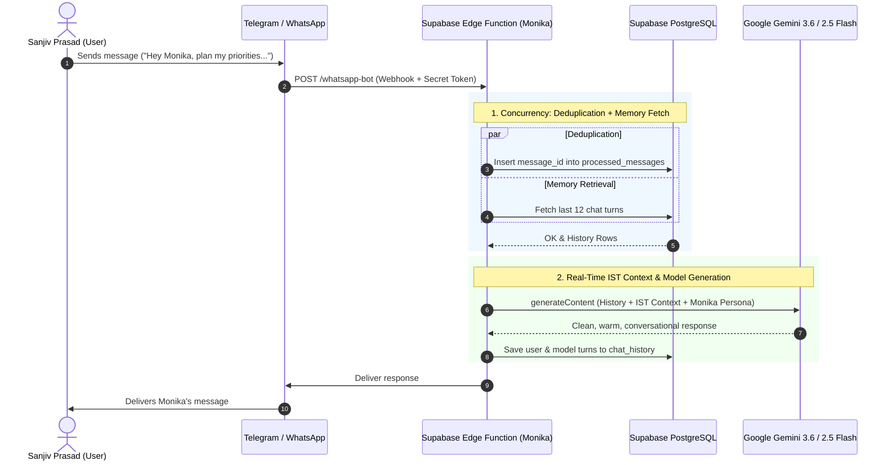

# 👩‍💼 Monika — Personal AI Assistant for Sanjiv Prasad

> A high-performance, 100% free-tier, serverless personal AI assistant powered by **Supabase Edge Functions (Deno / TypeScript)**, **Supabase PostgreSQL**, **Google Gemini 3.6 Flash / 2.5 Flash**, and multi-platform messaging webhooks (**Telegram & WhatsApp**).

---

## ✨ Features & Capabilities

- **Dedicated Persona**: Designed as an authentic, warm, loyal, and sharp Indian personal assistant created exclusively for **Sanjiv Prasad**.
- **Human Touch & Emotional Attunement**:
  - Responds with genuine assistant-like care for Sanjiv's wellbeing, energy, and work-life balance.
  - Understands and dynamically switches between crisp English and natural, polite Hinglish/Hindi.
  - Matches conversation energy: sends short 1-2 sentence replies to quick greetings, and structured in-depth answers to technical or business tasks.
- **Real-Time IST Situational Awareness**:
  - Automatically tracks current Indian Standard Time (IST).
  - Contextual time sensitivity: notices late night hours (encouraging rest/hydration) and brings morning focus.
- **High-Efficiency Engine**:
  - **In-Memory Model Caching**: Caches verified Gemini models across warm Edge Function invocations, eliminating redundant discovery calls and saving ~600ms per request.
  - **Parallel Database Operations**: Concurrent execution of deduplication and conversational memory retrieval cuts database roundtrip time in half.
- **Enterprise-Grade Security**:
  - **Telegram Secret Token Validation**: Protects webhooks against spoofed traffic using `X-Telegram-Bot-Api-Secret-Token`.
  - **Sender Authorization**: Whitelist protection via `ALLOWED_TELEGRAM_USERS` and `ALLOWED_PHONE_NUMBERS`.
  - **Input Sanitization & Boundary Protection**: Limits payloads to 4,000 characters to prevent token exhaustion attacks.
  - **Webhook Deduplication**: Prevents duplicate executions on retried events via PostgreSQL primary key constraints.

---

## 🏛️ Architecture



---

## 📁 Repository Structure

```text
.
├── .env.example                          # Environment variables & secrets template
├── .gitignore                            # Git ignore configuration for secrets & temporary files
├── deno.json                             # Deno runtime and compiler configuration
├── README.md                             # Project documentation
├── schema.sql                            # Supabase database schema & RLS policies
└── supabase/
    ├── config.toml                       # Supabase CLI project configuration
    └── functions/
        └── whatsapp-bot/
            └── index.ts                  # Edge Function (Monika Persona, Webhooks, Gemini API)
```

---

## 🚀 Quick Setup & Deployment Guide

### 1. Database Setup (Supabase)

1. Open your project on the [Supabase Dashboard](https://supabase.com/dashboard).
2. Go to **SQL Editor** and run the contents of [`schema.sql`](./schema.sql).
3. This creates:
   - `public.chat_history`: Conversation turns with sender, role, and timestamp.
   - `public.processed_messages`: Webhook deduplication store.
   - Row Level Security (RLS) policies and indexes.

---

### 2. Configure Supabase Secrets

Set your environment secrets using the Supabase CLI:

```bash
# Link your Supabase project
supabase link --project-ref <YOUR_SUPABASE_PROJECT_REF>

# Set secrets
supabase secrets set \
  GEMINI_API_KEY="<YOUR_GOOGLE_AI_STUDIO_KEY>" \
  SUPABASE_URL="https://<YOUR_PROJECT_REF>.supabase.co" \
  SUPABASE_SERVICE_ROLE_KEY="<YOUR_SERVICE_ROLE_SECRET_KEY>" \
  TELEGRAM_SECRET_TOKEN="<OPTIONAL_RANDOM_SECRET_STRING>" \
  ALLOWED_TELEGRAM_USERS="<YOUR_TELEGRAM_CHAT_ID>"
```

---

### 3. Deploy the Edge Function

```bash
supabase functions deploy whatsapp-bot --no-verify-jwt
```

Your webhook endpoint URL will be:
```text
https://<YOUR_PROJECT_REF>.supabase.co/functions/v1/whatsapp-bot
```

---

### 4. Connect Telegram Bot

1. Open Telegram and message **`@BotFather`**.
2. Send `/newbot`, choose a name and username, and copy the **Bot Token**.
3. Register the webhook with optional secret token:
   ```bash
   curl -F "url=https://<YOUR_PROJECT_REF>.supabase.co/functions/v1/whatsapp-bot" \
        -F "secret_token=<YOUR_TELEGRAM_SECRET_TOKEN>" \
        https://api.telegram.org/bot<YOUR_TELEGRAM_BOT_TOKEN>/setWebhook
   ```
4. Start chatting with Monika on Telegram!

---

## 🛡️ Security & Privacy

- All sensitive tokens, API keys, and service secrets are managed in **Supabase Vault / Secrets** and never committed to version control.
- Git configuration (`.gitignore`) strictly blocks `.env` files, local caches, and temporary files.
- PostgreSQL Row Level Security (RLS) ensures that only authenticated backend functions have write permissions.

---

## 👩‍💻 Author
Created by and for **Sanjiv Prasad**.
