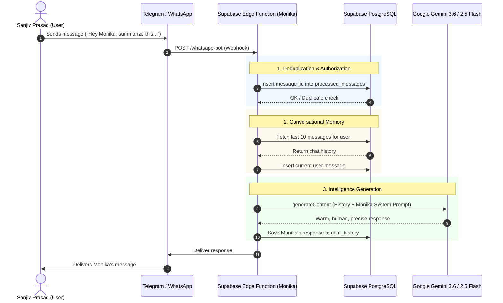

# 👩‍💼 Monika — Personal AI Assistant for Sanjiv Prasad

> A 100% free-tier, serverless personal AI assistant powered by **Supabase Edge Functions (Deno / TypeScript)**, **Supabase PostgreSQL**, **Google Gemini 3.6 Flash / 2.5 Flash**, and multi-platform messaging webhooks (**Telegram & WhatsApp**).

---

## ✨ Features & Personality

- **Monika's Identity**: Designed as a warm, respectful, intelligent, and highly capable Indian personal assistant created exclusively for **Sanjiv Prasad**.
- **Human-Centric & Precise**: Speaks with genuine assistant-like care, delivers crisp and practical answers without robotic fluff, and adapts smoothly between English and Hinglish/Hindi.
- **Persistent Conversational Memory**: Stores past interactions in Supabase PostgreSQL (`chat_history`) so Monika remembers previous turns in the conversation.
- **Smart Dynamic Model Discovery**: Automatically discovers available Gemini Flash models (`gemini-3.6-flash`, `gemini-2.5-flash`, etc.) and handles failovers seamlessly.
- **Webhook Deduplication**: Prevents duplicate message processing via `processed_messages` table.
- **100% Free Tier & Serverless**: Built on Supabase free-tier Edge Functions and Google AI Studio free tier.

---

## 🏛️ Architecture



---

## 📁 Repository Structure

```text
.
├── .env.example                          # Example environment variables template
├── .gitignore                            # Git ignore configuration for secrets & temporary files
├── deno.json                             # Deno compiler and import mappings
├── README.md                             # Project documentation
├── schema.sql                            # Supabase database schema & RLS policies
└── supabase/
    ├── config.toml                       # Supabase CLI project configuration
    └── functions/
        └── whatsapp-bot/
            └── index.ts                  # Edge Function (Monika Persona, Webhooks, Gemini API)
```

---

## 🚀 Quick Setup & Deployment Guide

### 1. Database Setup (Supabase)

1. Open your project on the [Supabase Dashboard](https://supabase.com/dashboard).
2. Go to **SQL Editor** and run the contents of [`schema.sql`](./schema.sql).
3. This creates:
   - `public.chat_history`: Conversation turns with sender, role, and timestamp.
   - `public.processed_messages`: Webhook deduplication store.
   - Row Level Security (RLS) policies and indexes.

---

### 2. Configure Supabase Secrets

Set your environment secrets using the Supabase CLI:

```bash
# Link your Supabase project
supabase link --project-ref <YOUR_SUPABASE_PROJECT_REF>

# Set secrets
supabase secrets set \
  GEMINI_API_KEY="<YOUR_GOOGLE_AI_STUDIO_KEY>" \
  SUPABASE_URL="https://<YOUR_PROJECT_REF>.supabase.co" \
  SUPABASE_SERVICE_ROLE_KEY="<YOUR_SERVICE_ROLE_SECRET_KEY>"
```

---

### 3. Deploy the Edge Function

```bash
supabase functions deploy whatsapp-bot --no-verify-jwt
```

Your webhook endpoint URL will be:
```text
https://<YOUR_PROJECT_REF>.supabase.co/functions/v1/whatsapp-bot
```

---

### 4. Connect Telegram Bot (1-Click)

1. Open Telegram and message **`@BotFather`**.
2. Send `/newbot`, choose a name and username, and copy the **Bot Token**.
3. Register the webhook by running:
   ```bash
   curl -F "url=https://<YOUR_PROJECT_REF>.supabase.co/functions/v1/whatsapp-bot" https://api.telegram.org/bot<YOUR_TELEGRAM_BOT_TOKEN>/setWebhook
   ```
4. Start chatting with Monika on Telegram!

---

### 5. Optional: Connect WhatsApp (Meta Cloud API / Twilio)

- **Twilio**: Set the WhatsApp Sandbox incoming message webhook to `POST https://<YOUR_PROJECT_REF>.supabase.co/functions/v1/whatsapp-bot`.
- **Meta WhatsApp Cloud API**: Set Callback URL to `https://<YOUR_PROJECT_REF>.supabase.co/functions/v1/whatsapp-bot`, enter your `VERIFY_TOKEN`, and subscribe to `messages`.

---

## 🛡️ Security & Privacy

- Sensitive tokens and API keys are managed securely via **Supabase Vault / Secrets** and never committed to version control.
- `.gitignore` strictly ignores local `.env` files and caches.
- PostgreSQL Row Level Security (RLS) ensures only authenticated backend services have write permissions.

---

## 👩‍💻 Author
Created by and for **Sanjiv Prasad**.
